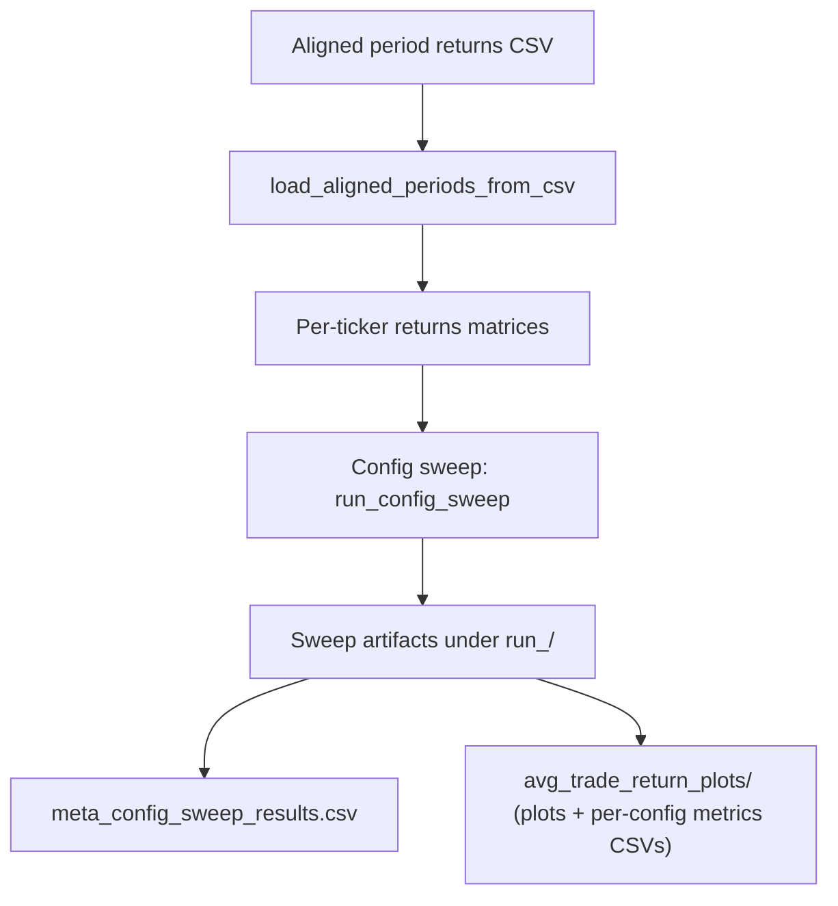
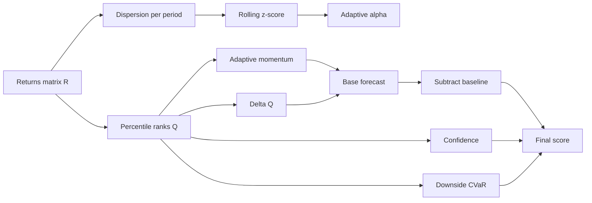
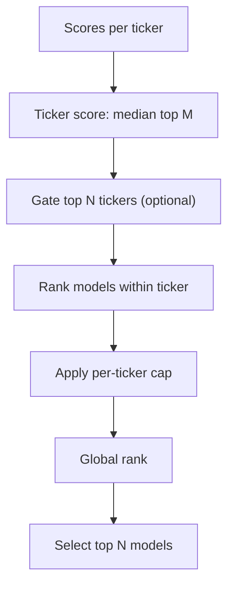

# Meta Model Guide

This document explains the meta-model pipeline implemented by the main driver script `adaptive_vol_momentum.py`, plus the supporting modules (`config.py`, `scoring.py`, `selection.py`, `io_periods.py`, `evaluation.py`, `reporting.py`, `sweep.py`). It is written to help a new analyst understand the math, the data flow, and where to improve the model.

Note: The downstream ensembling stage is intentionally out of scope for this guide and will be documented separately. The typical workflow today is to run `adaptive_vol_momentum.py` first (produce sweep artifacts), then run the ensembling stage afterwards.

## 1. Quick orientation

- Entrypoint: `adaptive_vol_momentum.py` runs a config sweep on aligned period returns and produces artifacts under `.../run_<timestamp>/` (e.g., `meta_config_sweep_results.csv` plus plots/metrics).
- Goal: Find robust scoring/selection parameters by sweeping configs, then evaluating the per-period top-N selections.
- Input: Aligned per-period returns CSV.
- Output: Sweep results CSV (one row per config) plus per-config plots/metrics.
- Core idea: For each ticker and period, convert raw returns into robust cross-sectional ranks, apply adaptive momentum + confidence + risk penalties to get a score per model, then select top models across tickers each period.

## 2. Data flow (high-level)



## 3. Inputs and shapes

### 3.1 `adaptive_vol_momentum.py`

- **Aligned period returns CSV (required)**: wide format with per-period columns such as `period_1_return`, `period_1_date_range`, `period_1_avg_return_per_trade`, `period_1_num_trades`, `period_2_return`, etc.
- **Loaded shape (via `io_periods.load_aligned_periods_from_csv`)**:
  - `aligned_returns[ticker]`: DataFrame with rows = `model_id`, columns = `period_key` ("YYYY-MM-DD to YYYY-MM-DD"), values = `period_return`.
  - Optional side columns `avg_return_per_trade` and `num_trades` are also loaded for evaluation.
- **Artifacts produced**: under `.../run_<timestamp>/`, including `meta_config_sweep_results.csv` plus plots/metrics per config.

## 4. Step-by-step pipeline for `adaptive_vol_momentum.py`

### 4.1 Step 0: Load config and ensure inputs

- Instantiate `MetaConfig` defaults (can be tweaked inline at the top of the script).
- Resolve the aligned returns path (`period_returns_weeks_2_aligned.csv` by default); error if missing.

### 4.2 Step 1: Load aligned data

- Read aligned CSV, drop duplicates.
- Build `aligned_returns` (per-ticker matrices) and `aligned_meta` via `io_periods.load_aligned_periods_from_csv` (same shapes as in Section 3.1).
- Log surviving tickers and common periods; abort if none remain.

### 4.3 Step 2: Prepare long-form data

- Convert the aligned wide frame to a long DataFrame with `wide_to_long_periods` for downstream evaluation.

### 4.4 Step 3: Set up run directory

- Create a timestamped run directory under `.../run_<timestamp>/` (sibling of the aligned artifacts).
- Define the sweep output path `meta_config_sweep_results.csv` inside that run directory.

### 4.5 Step 4: Run config sweep

- Call `run_config_sweep` with `aligned_returns`, `long_df`, and the current `MetaConfig`.
- Sweep hyperparameters over `n_configs` (default 100) with fixed seed/warmup/oos parameters.
- For each config, select models, compute equity curves, plots, and metrics. Scoring per ticker uses the logic in Section 6 (Score computation for one ticker).
- Append results to `meta_config_sweep_results.csv`; emit per-config plots/metrics under `avg_trade_return_plots/` and related CSVs.

### 4.6 Step 5: (Optional) Additional outputs

- Commented examples show how to save selections and equity curves; enable as needed if you want raw selections instead of just sweep metrics.

## 6. Score computation for one ticker

This section is the core math. All steps below are performed per ticker, for the aligned returns matrix `R` of shape (n_models, T). In the current pipeline, scoring is computed via `compute_scores_for_ticker_v2` (see `scoring.py`) and consumed by `select_models_universal_v2` (see `selection.py`) during the sweep.

### 6.1 Notation

- `R_{i,t}` = period return of model `i` at period `t`.
- `Q_{i,t}` = percentile rank of `R_{i,t}` across models for period `t` (in [0,1]).
- `M_{i,t}` = adaptive momentum signal.
- `S_{i,t}` = final score.

### 6.2 Step 1: Dispersion -> adaptive alpha

Goal: quantify how much the models disagree within a period, then use that to decide how fast the momentum signal should adapt.

#### 6.2.1 Dispersion within a single period (robust spread)

We want a single number that says "how spread out are the model returns this period?" Instead of a standard deviation (which can be distorted by outliers), we use the MAD-based robust std:

- `disp_t = 1.4826 * median(|R_{i,t} - median(R_{:,t})|)`

Intuition:

- Take the median return for the period (a robust "center").
- Measure how far each model is from that median.
- The median of those distances is the MAD (median absolute deviation).
- Multiply by 1.4826 so that, for a normal distribution, this behaves like a standard deviation.

Toy example for one period (5 models):

```
returns:  [-0.01, 0.00, 0.01, 0.02, 0.10]
median:   0.01
abs devs: [0.02, 0.01, 0.00, 0.01, 0.09]
MAD:      0.01
disp_t:   1.4826 * 0.01 = 0.014826
```

So `disp_t` is the "typical spread" around the median, but robust to that 0.10 outlier.

#### 6.2.2 Is dispersion unusually high or low?

Dispersion itself is not enough; we care about whether it is high *relative to recent history*. We standardize it with a rolling z-score over a window `vol_window`:

- `z_t = (disp_t - mean(disp_{t-w+1:t})) / std(disp_{t-w+1:t})`

Intuition:

- `z_t > 0` means dispersion is higher than usual.
- `z_t < 0` means dispersion is lower than usual.
- The magnitude tells you how unusual it is.

Example scenarios (assume recent window mean=0.02, std=0.005):

```
Case A (normal-ish): disp_t = 0.02
z_t = (0.02 - 0.02) / 0.005 = 0.0  -> typical dispersion

Case B (high dispersion): disp_t = 0.035
z_t = (0.035 - 0.02) / 0.005 = 3.0 -> much higher than usual

Case C (low dispersion): disp_t = 0.0125
z_t = (0.0125 - 0.02) / 0.005 = -1.5 -> lower than usual
```

In practice, large positive `z_t` values occur when a few models are far apart (big disagreement), while large negative `z_t` values occur when most models are clustered tightly (high agreement).

#### 6.2.3 Map dispersion regime to a smoothing speed (alpha)

We convert `z_t` into a time-varying EMA alpha. Think of `alpha_t` as the "speed knob" for the momentum signal:

- High `alpha_t` = fast response to recent changes (short memory).
- Low `alpha_t` = slow response (long memory, more smoothing).

Because dispersion changes over time, we want the smoothing speed to change over time too. That is all "time-varying EMA alpha" means: the EMA uses a different alpha each period instead of a single fixed value.

- `alpha_t = map(z_t)`
- Then `alpha_t` is smoothed again with an EMA (`alpha_smooth`) so it does not jump around too much.

Mapping is linear between `alpha_low` and `alpha_high`, clipped by `z_low` and `z_high`:

```
frac = (clip(z_t, z_low, z_high) - z_low) / (z_high - z_low)
alpha_t = alpha_low + frac * (alpha_high - alpha_low)
```

Intuition for these equations:

- `clip(z_t, z_low, z_high)` caps extreme dispersion so the mapping stays stable.
- The `frac` line rescales the clipped z-score from the range `[z_low, z_high]` into `[0, 1]`.
- The second line is just a linear interpolation between `alpha_low` and `alpha_high` using that 0..1 fraction.

In words: "convert how unusual dispersion is into a normalized slider (0..1), then slide between the slowest and fastest allowed EMA speeds."

Interpretation:

- Higher dispersion => larger `alpha_t` => *shorter memory* (the model reacts faster to recent info).
- Lower dispersion => smaller `alpha_t` => *longer memory* (the model smooths more and changes slowly).

In plain terms: when models strongly disagree, we trust recent data more; when they agree, we let the trend evolve slowly.

Example (assume `alpha_low=0.30`, `alpha_high=0.70`, `z_low=-1`, `z_high=1`):

```
Case A (low dispersion): z_t = -1.0 -> alpha_t = 0.30
Case B (typical):        z_t =  0.0 -> alpha_t = 0.50
Case C (high dispersion):z_t =  1.0 -> alpha_t = 0.70
```

What this changes downstream:

- The adaptive momentum in Step 3 uses `alpha_t` to weight recent periods.
- In Case C, recent rank changes dominate (faster adaptation).
- In Case A, older ranks still matter more (slower adaptation).

Mapping vs smoothing (important distinction):

- The mapping step converts dispersion z-scores into a *raw* alpha for the current period:

```
frac = (clip(z_t, z_low, z_high) - z_low) / (z_high - z_low)
alpha_raw_t = alpha_low + frac * (alpha_high - alpha_low)
```

- The smoothing step then uses an EMA over time to avoid jumps:

```
alpha_t = alpha_smooth * alpha_raw_t + (1 - alpha_smooth) * alpha_{t-1}
```

Although the update uses only `alpha_raw_t` and `alpha_{t-1}`, this is a full EMA: `alpha_{t-1}` already contains all prior history with exponentially decaying weights.

Note on clipping:

- We clip `z_t` to `[z_low, z_high]` so `alpha_raw_t` always stays inside `[alpha_low, alpha_high]`.
- This prevents rare dispersion spikes from creating extreme alpha values that would overreact or over-smooth.

Visual intuition (mapping):

```
alpha
0.70 |           ________ alpha_high
     |          /
0.50 |         /
0.30 |________/  alpha_low
     +---------------------
      z_low   0    z_high
```

Example lookup (with defaults):

```
z_t     alpha_raw_t
-2.0 -> 0.30  (clipped to z_low)
-1.0 -> 0.30
 0.0 -> 0.50
 1.0 -> 0.70
 2.0 -> 0.70  (clipped to z_high)
```

Full worked examples (including the EMA smoothing step):

```
Defaults:
alpha_low=0.30, alpha_high=0.70, z_low=-1, z_high=1, vol_window=4, alpha_smooth=0.30
```

Low dispersion:

```
disp window: [0.010, 0.012, 0.011, 0.009]
mean = 0.0105
std  = 0.0011 (approx)
current disp_t = 0.009
z_t = (0.009 - 0.0105) / 0.0011 approx -1.36 -> clip to -1.0
alpha_raw = 0.30
```

If previous alpha was 0.40:

```
alpha_t = 0.30 * 0.30 + 0.70 * 0.40 = 0.37
```

Where the numbers come from:

- `0.30` (first) is `alpha_smooth` (the EMA smoothing factor).
- `0.30` (second) is `alpha_raw` from the clipped z-score mapping.
- `0.70` is `(1 - alpha_smooth)`.
- `0.40` is the previous smoothed alpha value (`alpha_{t-1}`).

High dispersion:

```
disp window: [0.020, 0.022, 0.018, 0.021]
mean = 0.02025
std  = 0.0017 (approx)
current disp_t = 0.024
z_t = (0.024 - 0.02025) / 0.0017 approx 2.21 -> clip to 1.0
alpha_raw = 0.70
```

If previous alpha was 0.40:

```
alpha_t = 0.30 * 0.70 + 0.70 * 0.40 = 0.49
```

### 6.3 Step 2: Percentile ranks

Convert raw returns into cross-sectional ranks per period:

- `Q_{i,t} = rank(R_{i,t} among models at t)`, scaled to [0,1]

This makes the scoring robust to scale differences and outliers.

How it works (toy example, one period):

```
returns by model:
Model A:  0.03
Model B: -0.01
Model C:  0.00
Model D:  0.02

sorted values: [-0.01, 0.00, 0.02, 0.03]
ranks:          1      2     3     4
percentiles:   (rank-1)/(n-1) with n=4
             -> [0.00, 0.33, 0.67, 1.00]
```

So the percentile ranks are:

```
Model A: 1.00
Model B: 0.00
Model C: 0.33
Model D: 0.67
```

Notes:

- NaNs are ignored when ranking (models with missing returns get NaN ranks).
- Ties are assigned adjacent ranks (no averaging), so equal values will get close but not identical percentiles.
- No `MetaConfig` parameters affect this step; it is purely a per-period cross-sectional ranking.

### 6.4 Step 3: Adaptive momentum of ranks

Two options exist; the current path uses a bounded lookback window:

- `M_{i,t} = weighted_avg(Q_{i, t-L+1:t})`
- Weights are derived from the time-varying `alpha_t` (higher alpha emphasizes recent periods).

Intuition:

- `Q_{i,t}` is the rank of model `i` this period.
- `M_{i,t}` is a smoothed version of that rank over recent periods.
- If ranks are steadily improving, `M_{i,t}` rises.
- If ranks are choppy, `M_{i,t}` stays closer to the recent average.

What makes it "adaptive" is that the weights change with `alpha_t`:

- When dispersion is high, `alpha_t` is larger, so the most recent ranks get more weight.
- When dispersion is low, `alpha_t` is smaller, so the window is flatter (more smoothing).

Config values used here:

- `enable_momentum_lookback`: if True, use a fixed window of size `momentum_lookback`.
- `momentum_lookback`: how many periods are included in the window when enabled.
- `alpha_t`: time-varying weight derived in Step 1.

Toy example (single model, one period t, fixed alpha for simplicity):

```
Q history over last 3 periods (L=3):
Q_{i,t-2} = 0.20
Q_{i,t-1} = 0.50
Q_{i,t}   = 0.90

Assume alpha_t = 0.50 (constant in this toy example).
Window weights (after normalization) are roughly:
[0.14, 0.29, 0.57]  # oldest -> newest

M_{i,t} = 0.20*0.14 + 0.50*0.29 + 0.90*0.57
        = 0.028 + 0.145 + 0.513
        = 0.686 (approx)
```

If alpha_t were higher (say 0.70), the newest period would get even more weight and M_{i,t} would move closer to 0.90. If alpha_t were lower (say 0.30), the weights would be flatter and M_{i,t} would move closer to the simple average.

This is implemented by `_adaptive_momentum_window` when `enable_momentum_lookback` is True. If it is False, `_adaptive_momentum_recursive` uses a standard EMA over all history (no fixed lookback).

### 6.5 Step 4: Delta adjustment

Add a small delta term to capture recent acceleration:

- `D_{i,t} = Q_{i,t} - Q_{i,t-1}`
- `base_{i,t} = M_{i,t} + delta_weight * D_{i,t}`

Intuition:

- `M_{i,t}` is a smoothed rank signal, so it can lag when a model suddenly improves or deteriorates.
- `D_{i,t}` is the *one-period change* in rank, so it catches that short-term acceleration.
- `delta_weight` controls how much of this short-term change we add on top of the smoother momentum.

Toy example:

```
Assume:
M_{i,t} = 0.60
Q_{i,t-1} = 0.40
Q_{i,t}   = 0.70
delta_weight = 0.20

D_{i,t} = 0.70 - 0.40 = 0.30
base_{i,t} = 0.60 + 0.20 * 0.30
          = 0.60 + 0.06
          = 0.66
```

If the rank is falling instead:

```
Q_{i,t-1} = 0.70
Q_{i,t}   = 0.40
D_{i,t} = -0.30
base_{i,t} = 0.60 + 0.20 * (-0.30) = 0.54
```

Config value used here:

- `delta_weight` (from `MetaConfig`)

### 6.6 Step 5: Ticker-local baseline

Subtract a cross-sectional baseline to convert to "relative" performance within the ticker:

- `baseline_t = median_i(base_{i,t})` (or mean if configured)
- `rel_{i,t} = base_{i,t} - baseline_t`

Intuition:

- Raw scores (`base_{i,t}`) can drift up or down together if the whole ticker is in a strong or weak regime.
- Subtracting the baseline recenters the scores so we measure *relative* strength within the ticker for that period.
- This keeps the ranking fair even if the entire ticker’s models are having a great (or terrible) period.

Toy example (one period):

```
base scores by model:
Model A: 0.20
Model B: 0.10
Model C: 0.05
Model D: 0.00

baseline_t = median(base) = (0.05 + 0.10)/2 = 0.075

relative scores:
Model A: 0.20 - 0.075 = 0.125
Model B: 0.10 - 0.075 = 0.025
Model C: 0.05 - 0.075 = -0.025
Model D: 0.00 - 0.075 = -0.075
```

Config value used here:

- `baseline_method` (`median` or `mean`)

### 6.7 Step 6: Confidence (training-free)

Confidence is higher when a model's rank is stable and participation is high:

- `std_{i,t}` = rolling std of `Q_{i,t}` over `conf_lookback`
- `participation_{i,t}` = fraction of non-NaN values in the window
- `raw_conf_{i,t} = 1 / (std_{i,t} + conf_eps) * sqrt(participation_{i,t})`
- `CONF_{i,t}` = percentile rank of `raw_conf_{i,t}` across models

Intuition:

- If a model’s rank is steady over the last `conf_lookback` periods, its `std_{i,t}` is small.
- Small std means the model is consistently good (or consistently bad), which is more reliable than a model that whipsaws.
- `participation_{i,t}` downweights models that are missing lots of data.
- The final `CONF_{i,t}` is a percentile rank so confidence is compared *within* the ticker at each period.

Toy example (one period, 3-period lookback):

```
Model A ranks (last 3): [0.80, 0.82, 0.79]  -> std approx 0.015
Model B ranks (last 3): [0.20, 0.90, 0.10]  -> std approx 0.36
Model C ranks (last 3): [0.50, 0.50, 0.50]  -> std = 0.00

Assume full participation for all models, conf_eps = 1e-8:
raw_conf = 1 / (std + conf_eps)
Model A: 1 / 0.015 = 66.7
Model B: 1 / 0.36  = 2.8
Model C: 1 / 0.00  -> very large (capped only by conf_eps)
```

After percentile ranking within the ticker for that period:

- Model C gets the highest confidence.
- Model A gets medium confidence.
- Model B gets low confidence.

Config values used here:

- `conf_lookback` (window length)
- `conf_eps` (stability floor to avoid divide-by-zero)

### 6.8 Step 7: Risk penalty (downside CVaR)

A risk penalty is computed on rank residuals:

- `resid_{i,t} = Q_{i,t} - 0.5`
- For each model, compute rolling downside CVaR on `resid` over `risk_lookback`:
  - `CVaR_{i,t} = mean(resid in worst alpha tail)`
  - Implemented on the negative tail, then negated to be a positive penalty.
- `risk_pen_{i,t} = cvar_risk_aversion * CVaR_{i,t}`

This penalizes models with frequent or deep negative rank deviations.

Intuition:

- `Q_{i,t}` is a rank in [0, 1]. Subtracting 0.5 recenters it around "average."  
  - Positive residuals mean the model is usually above average.
  - Negative residuals mean it is below average.
- CVaR focuses on the *worst* residuals (left tail), not the typical ones.
- If a model has occasional large negative drops in rank, its downside CVaR rises, and the penalty increases.

Toy example (one model, 6-period lookback, `cvar_alpha = 0.20`):

```
Q history:     [0.60, 0.55, 0.20, 0.70, 0.10, 0.40]
residuals:     [0.10, 0.05, -0.30, 0.20, -0.40, -0.10]

Worst 20% tail (1 value out of 6) is about the most negative residual:
tail = [-0.40]
CVaR = mean(tail) = -0.40
downside CVaR penalty = max(0, -CVaR) = 0.40

If cvar_risk_aversion = 0.75:
risk_pen = 0.75 * 0.40 = 0.30
```

So a model that occasionally collapses in rank gets its score reduced more than a model with smaller, steadier fluctuations.

Config values used here:

- `risk_lookback` (rolling window length)
- `cvar_alpha` (tail depth, e.g., 0.10 = worst 10%)
- `cvar_risk_aversion` (penalty strength)
- `cvar_window_stride` (optional downsampling inside the window for speed)

### 6.9 Step 8: Uniqueness weighting

`compute_uniqueness_weights` currently returns all-ones to avoid leakage. The intended behavior is:

- Cluster highly correlated models.
- Downweight models in larger clusters.

If activated, this scales the final score by a per-model weight.

### 6.10 Step 9: Final score and causal shift

Final score:

- `S_{i,t} = uniq_i * (rel_{i,t} * CONF_{i,t} - risk_pen_{i,t})`

Then the score is shifted by 1 period to keep it causal:

- score for period `t` uses data up through period `t-1`.

Intuition:

- `rel_{i,t}` says whether a model is better or worse than its peers this period.
- `CONF_{i,t}` scales that by how *stable* the model has been.
- `risk_pen_{i,t}` subtracts a penalty for downside rank shocks.
- `uniq_i` (when enabled) shrinks scores for highly redundant models.

So the final score is: "relative strength, adjusted for stability, penalized for downside risk, and de-duplicated."

Causal shift (why it matters):

- When you select models for period `t`, you should only use information available *before* period `t` starts.
- The shift enforces that: scores computed with data through `t-1` are applied to period `t`.
- This prevents look-ahead bias in backtests.

Toy timeline:

```
Period 1 returns -> compute score for Period 2
Period 2 returns -> compute score for Period 3
...
```

In code, this is implemented as:

```
scores_df = scores_df.shift(axis=1)
ticker_score = ticker_score.shift(1)
```

### 6.11 Step 10: Ticker score

For each period, compute a per-ticker gate score:

- `ticker_score_t = median(top M scores at t)`

This is used in the cross-ticker selection gate.

## 8. Selection logic in detail

This selection runs once per config during the sweep (see `select_models_universal_v2`), after computing per-ticker per-model scores.

1) Build a long table of `(ticker, model_id, period, score)`.
2) For each ticker, compute `ticker_score` as median of top `top_m_for_ticker_gate` model scores.
3) Optionally filter tickers by `min_ticker_score`.
4) For each period, rank tickers by ticker_score.
5) Choose tickers for the period. If `include_n_top_tickers` is `None`, keep all tickers; otherwise keep the top `include_n_top_tickers` tickers by `ticker_score`.
6) From chosen tickers, rank models within each ticker by score.
7) Apply `per_ticker_cap` if set.
8) Global ranking by score across tickers; keep top `top_n_global`.

This intentionally balances breadth (multiple tickers) and depth (best models) per period.

## 9. Output artifacts

`adaptive_vol_momentum.py` writes sweep artifacts under the run directory (paths depend on CLI arguments):

- `meta_config_sweep_results.csv` (main sweep output; one row per config)
- `avg_trade_return_plots/` (per-config plots + per-config metrics CSVs such as `core_metrics_config_*.csv`, `trade_metrics_config_*.csv`, etc.)

## 10. Worked mini-example (toy numbers)

Assume one ticker with 3 models and 4 periods. Returns matrix R:

```
R =
model A: [ 0.02, -0.01,  0.03,  0.00]
model B: [ 0.01,  0.00,  0.02, -0.01]
model C: [-0.01,  0.01,  0.00,  0.02]
```

Percentile ranks per period (`Q_{i,t}`), where 0 is worst and 1 is best:

- Period 1 ranks: A(1.0), B(0.5), C(0.0)
- Period 2 ranks: C(1.0), B(0.5), A(0.0)
- Period 3 ranks: A(1.0), B(0.5), C(0.0)
- Period 4 ranks: C(1.0), A(0.5), B(0.0)

This rank series becomes the input for momentum, confidence, and risk. Even if returns are small, a model that consistently ranks high will score well.

A simple confidence example (ignoring participation):

- If model A's rank sequence is stable over the last 3 periods, std is small -> high confidence.
- If model B's ranks swing more, std is larger -> lower confidence.

Risk penalty example:

- Suppose the residuals `Q - 0.5` for model B over the last 5 periods are mostly negative; downside CVaR becomes positive and subtracts from the score.

## 11. Diagrams

### 11.1 Scoring pipeline (per ticker)



### 11.2 Selection pipeline (per period)



## 12. Where to improve (starter ideas)

1) Uniqueness weighting: The function currently returns all-ones. Implement the intended correlation clustering to reduce duplicates.
2) Ticker gate rule: you can keep all tickers, or gate to a fixed `N` best tickers using `include_n_top_tickers`.
3) Confidence/risk shaping: Try different confidence transforms or risk penalties (e.g., asymmetric penalties for streaks).
4) Revisit causal shift: Ensure the shift aligns with how periods are defined and how selection would be executed live.

## 13. CLI usage (typical)

```
python adaptive_vol_momentum.py --aligned-file C:\path\to\period_returns_weeks_2_aligned.csv --output-dir C:\path\to\run_YYYYMMDD_HHMMSS
```

## 14. Key parameters to know

These are in `MetaConfig`:

- `vol_window`, `alpha_low`, `alpha_high`, `alpha_smooth`: adaptive alpha for momentum.
- `momentum_lookback`, `delta_weight`: rank momentum and acceleration.
- `conf_lookback`, `conf_eps`: confidence window and stability control.
- `risk_lookback`, `cvar_alpha`, `cvar_risk_aversion`: downside risk penalty.
- `top_n_global`, `top_m_for_ticker_gate`, `per_ticker_cap`, `min_ticker_score`: selection rules.

## 15. Pointers into code

- Pipeline driver: `adaptive_vol_momentum.py`
- Config defaults: `config.py`
- Scoring math: `scoring.py`
- Selection: `selection.py`
- Sweep runner: `sweep.py`
- Alignment and parsing: `io_periods.py`
- Evaluation plots: `evaluation.py`
- Metrics: `reporting.py`
