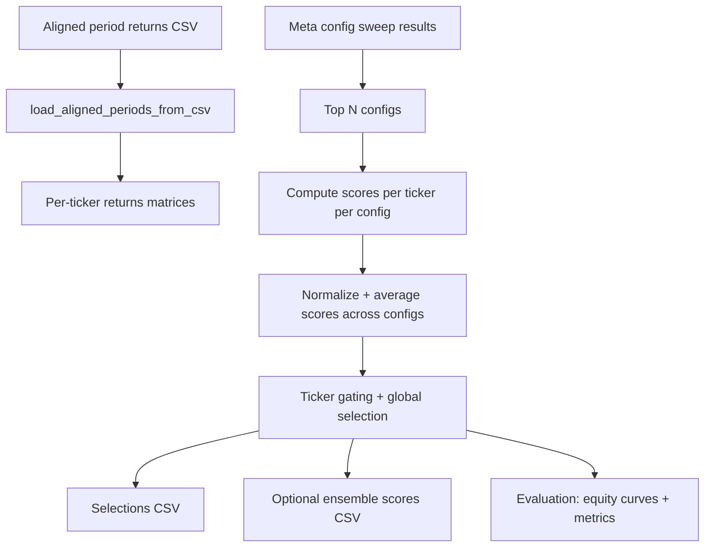
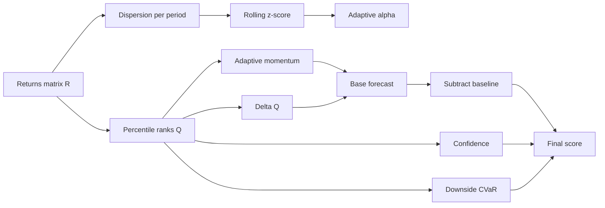

# Meta Model Guide

This document explains how the current meta model works end to end, based on the code in `meta_ensemble_from_sweep.py` and supporting modules (`config.py`, `scoring.py`, `io_periods.py`, `evaluation.py`, `reporting.py`). It is written to help a new analyst understand the math, the data flow, and where to improve the model.

## Quick orientation

- Goal: Select a small set of the best-performing models each period (the "meta" portfolio) using training-free, per-ticker signals.
- Inputs: Aligned per-period returns for many models and sweep results for config selection.
- Output: A per-period selection of models plus evaluation metrics and plots.
- Core idea: For each ticker, compute per-model scores based on rank momentum, confidence, and risk penalties, then select top models across tickers each period.

## Data flow (high-level)



## Inputs and shapes

### 1) Aligned period returns CSV

The aligned file is a wide CSV with columns like:

- `period_1_return`, `period_1_date_range`, `period_1_avg_return_per_trade`, `period_1_num_trades`
- `period_2_return`, ... and so on

`io_periods.load_aligned_periods_from_csv` converts this into per-ticker matrices:

- `aligned_returns[ticker]` is a DataFrame:
  - rows: `model_id`
  - columns: `period_key` ("YYYY-MM-DD to YYYY-MM-DD")
  - values: `period_return`

Optional `avg_return_per_trade` and `num_trades` are also loaded for later evaluation.

### 2) Sweep results

`sweep_results` is a CSV with one row per config tested. The meta model picks the top `--top-n-configs` rows by a chosen metric (default: `mean_topN_avg_return_per_trade_pct`).

Those rows supply parameter values used in scoring (see `MetaConfig`).

## Step-by-step pipeline

### Step 0. Load and filter aligned data

- Load aligned returns and build `aligned_returns: Dict[str, DataFrame]`.
- If no tickers remain after filters, stop.

### Step 1. Choose top configs from sweep

- Read sweep results, filter to `status == "ok"` if present.
- Keep top `--top-n-configs` by the chosen metric.
- Build the "selection config" from the best row; other configs use the same base defaults but replace any values provided in their rows.

### Step 2. Score each ticker under each config

For each ticker and each selected config:

1) Compute per-model scores by period using `compute_scores_for_ticker_v2`.
2) Optionally normalize scores per period via percentiles.
3) Average scores across configs for that ticker.

The result is `scores_by_ticker[ticker]`: a DataFrame of mean scores (models x periods).

### Step 3. Select models (gated by tickers)

- Compute a per-ticker "ticker score" per period from the scores (median of top M models).
- Optionally drop tickers below `min_ticker_score`.
- For each period:
  - Rank tickers by ticker score.
  - Select the top `k` tickers where `k = floor(sqrt(#eligible_tickers))` (at least 1).
  - Within those tickers, rank models by score.
  - Apply `per_ticker_cap` if set.
  - Globally rank remaining candidates and keep `top_n_global`.

This yields the final selection file.

### Step 4. Evaluate (optional)

If `--skip-analysis` is not set:

- Build equity curves for "all models" vs "top-N" selections.
- Compute core, relative, stability, trade-quality, and significance metrics.
- Optionally render plots.

## Score computation for one ticker

This section is the core math. All steps below are performed per ticker, for the aligned returns matrix `R` of shape (n_models, T). The v2 implementation in `scoring.py` is used in the meta ensemble.

### Notation

- `R_{i,t}` = period return of model `i` at period `t`.
- `Q_{i,t}` = percentile rank of `R_{i,t}` across models for period `t` (in [0,1]).
- `M_{i,t}` = adaptive momentum signal.
- `S_{i,t}` = final score.

### Step 1. Dispersion -> adaptive alpha

Goal: quantify how much the models disagree within a period, then use that to decide how fast the momentum signal should adapt.

#### 1) Dispersion within a single period (robust spread)

We want a single number that says "how spread out are the model returns this period?" Instead of a standard deviation (which can be distorted by outliers), we use the MAD-based robust std:

- `disp_t = 1.4826 * median(|R_{i,t} - median(R_{:,t})|)`

Intuition:

- Take the median return for the period (a robust "center").
- Measure how far each model is from that median.
- The median of those distances is the MAD (median absolute deviation).
- Multiply by 1.4826 so that, for a normal distribution, this behaves like a standard deviation.

Toy example for one period (5 models):

```
returns:  [-0.01, 0.00, 0.01, 0.02, 0.10]
median:   0.01
abs devs: [0.02, 0.01, 0.00, 0.01, 0.09]
MAD:      0.01
disp_t:   1.4826 * 0.01 = 0.014826
```

So `disp_t` is the "typical spread" around the median, but robust to that 0.10 outlier.

#### 2) Is dispersion unusually high or low?

Dispersion itself is not enough; we care about whether it is high *relative to recent history*. We standardize it with a rolling z-score over a window `vol_window`:

- `z_t = (disp_t - mean(disp_{t-w+1:t})) / std(disp_{t-w+1:t})`

Intuition:

- `z_t > 0` means dispersion is higher than usual.
- `z_t < 0` means dispersion is lower than usual.
- The magnitude tells you how unusual it is.

Example scenarios (assume recent window mean=0.02, std=0.005):

```
Case A (normal-ish): disp_t = 0.02
z_t = (0.02 - 0.02) / 0.005 = 0.0  -> typical dispersion

Case B (high dispersion): disp_t = 0.035
z_t = (0.035 - 0.02) / 0.005 = 3.0 -> much higher than usual

Case C (low dispersion): disp_t = 0.0125
z_t = (0.0125 - 0.02) / 0.005 = -1.5 -> lower than usual
```

In practice, large positive `z_t` values occur when a few models are far apart (big disagreement), while large negative `z_t` values occur when most models are clustered tightly (high agreement).

#### 3) Map dispersion regime to a smoothing speed (alpha)

We convert `z_t` into a time-varying EMA alpha. Think of `alpha_t` as the "speed knob" for the momentum signal:

- High `alpha_t` = fast response to recent changes (short memory).
- Low `alpha_t` = slow response (long memory, more smoothing).

Because dispersion changes over time, we want the smoothing speed to change over time too. That is all "time-varying EMA alpha" means: the EMA uses a different alpha each period instead of a single fixed value.

- `alpha_t = map(z_t)`
- Then `alpha_t` is smoothed again with an EMA (`alpha_smooth`) so it does not jump around too much.

Mapping is linear between `alpha_low` and `alpha_high`, clipped by `z_low` and `z_high`:

```
frac = (clip(z_t, z_low, z_high) - z_low) / (z_high - z_low)
alpha_t = alpha_low + frac * (alpha_high - alpha_low)
```

Interpretation:

- Higher dispersion => larger `alpha_t` => *shorter memory* (the model reacts faster to recent info).
- Lower dispersion => smaller `alpha_t` => *longer memory* (the model smooths more and changes slowly).

In plain terms: when models strongly disagree, we trust recent data more; when they agree, we let the trend evolve slowly.

Example (assume `alpha_low=0.30`, `alpha_high=0.70`, `z_low=-1`, `z_high=1`):

```
Case A (low dispersion): z_t = -1.0 -> alpha_t = 0.30
Case B (typical):        z_t =  0.0 -> alpha_t = 0.50
Case C (high dispersion):z_t =  1.0 -> alpha_t = 0.70
```

What this changes downstream:

- The adaptive momentum in Step 3 uses `alpha_t` to weight recent periods.
- In Case C, recent rank changes dominate (faster adaptation).
- In Case A, older ranks still matter more (slower adaptation).

Mapping vs smoothing (important distinction):

- The mapping step converts dispersion z-scores into a *raw* alpha for the current period:

```
frac = (clip(z_t, z_low, z_high) - z_low) / (z_high - z_low)
alpha_raw_t = alpha_low + frac * (alpha_high - alpha_low)
```

- The smoothing step then uses an EMA over time to avoid jumps:

```
alpha_t = alpha_smooth * alpha_raw_t + (1 - alpha_smooth) * alpha_{t-1}
```

Note on clipping:

- We clip `z_t` to `[z_low, z_high]` so `alpha_raw_t` always stays inside `[alpha_low, alpha_high]`.
- This prevents rare dispersion spikes from creating extreme alpha values that would overreact or over-smooth.

Visual intuition (mapping):

```
alpha
0.70 |           ________ alpha_high
     |          /
0.50 |         /
0.30 |________/  alpha_low
     +---------------------
      z_low   0    z_high
```

Example lookup (with defaults):

```
z_t     alpha_raw_t
-2.0 -> 0.30  (clipped to z_low)
-1.0 -> 0.30
 0.0 -> 0.50
 1.0 -> 0.70
 2.0 -> 0.70  (clipped to z_high)
```

Full worked examples (including the EMA smoothing step):

```
Defaults:
alpha_low=0.30, alpha_high=0.70, z_low=-1, z_high=1, vol_window=4, alpha_smooth=0.30
```

Low dispersion:

```
disp window: [0.010, 0.012, 0.011, 0.009]
mean = 0.0105
std  = 0.0011 (approx)
current disp_t = 0.009
z_t = (0.009 - 0.0105) / 0.0011 ≈ -1.36 -> clip to -1.0
alpha_raw = 0.30
```

If previous alpha was 0.40:

```
alpha_t = 0.30 * 0.30 + 0.70 * 0.40 = 0.37
```

Where the numbers come from:

- `0.30` (first) is `alpha_smooth` (the EMA smoothing factor).
- `0.30` (second) is `alpha_raw` from the clipped z-score mapping.
- `0.70` is `(1 - alpha_smooth)`.
- `0.40` is the previous smoothed alpha value (`alpha_{t-1}`).

High dispersion:

```
disp window: [0.020, 0.022, 0.018, 0.021]
mean = 0.02025
std  = 0.0017 (approx)
current disp_t = 0.024
z_t = (0.024 - 0.02025) / 0.0017 ≈ 2.21 -> clip to 1.0
alpha_raw = 0.70
```

If previous alpha was 0.40:

```
alpha_t = 0.30 * 0.70 + 0.70 * 0.40 = 0.49
```

### Step 2. Percentile ranks

Convert raw returns into cross-sectional ranks per period:

- `Q_{i,t} = rank(R_{i,t} among models at t)`, scaled to [0,1]

This makes the scoring robust to scale differences and outliers.

### Step 3. Adaptive momentum of ranks

Two options exist; the current path uses a bounded lookback window:

- `M_{i,t} = weighted_avg(Q_{i, t-L+1:t})`
- Weights are derived from the time-varying `alpha_t` (higher alpha emphasizes recent periods).

This is implemented by `_adaptive_momentum_window`.

### Step 4. Delta adjustment

Add a small delta term to capture recent acceleration:

- `D_{i,t} = Q_{i,t} - Q_{i,t-1}`
- `base_{i,t} = M_{i,t} + delta_weight * D_{i,t}`

### Step 5. Ticker-local baseline

Subtract a cross-sectional baseline to convert to "relative" performance within the ticker:

- `baseline_t = median_i(base_{i,t})` (or mean if configured)
- `rel_{i,t} = base_{i,t} - baseline_t`

### Step 6. Confidence (training-free)

Confidence is higher when a model's rank is stable and participation is high:

- `std_{i,t}` = rolling std of `Q_{i,t}` over `conf_lookback`
- `participation_{i,t}` = fraction of non-NaN values in the window
- `raw_conf_{i,t} = 1 / (std_{i,t} + conf_eps) * sqrt(participation_{i,t})`
- `CONF_{i,t}` = percentile rank of `raw_conf_{i,t}` across models

### Step 7. Risk penalty (downside CVaR)

A risk penalty is computed on rank residuals:

- `resid_{i,t} = Q_{i,t} - 0.5`
- For each model, compute rolling downside CVaR on `resid` over `risk_lookback`:
  - `CVaR_{i,t} = mean(resid in worst alpha tail)`
  - Implemented on the negative tail, then negated to be a positive penalty.
- `risk_pen_{i,t} = cvar_risk_aversion * CVaR_{i,t}`

This penalizes models with frequent or deep negative rank deviations.

### Step 8. Uniqueness weighting

`compute_uniqueness_weights` currently returns all-ones to avoid leakage. The intended behavior is:

- Cluster highly correlated models.
- Downweight models in larger clusters.

If activated, this scales the final score by a per-model weight.

### Step 9. Final score and causal shift

Final score:

- `S_{i,t} = uniq_i * (rel_{i,t} * CONF_{i,t} - risk_pen_{i,t})`

Then the score is shifted by 1 period to keep it causal:

- score for period `t` uses data up through period `t-1`.

### Step 10. Ticker score

For each period, compute a per-ticker gate score:

- `ticker_score_t = median(top M scores at t)`

This is used in the cross-ticker selection gate.

## Ensemble across configs

The meta ensemble averages scores from multiple configs to smooth sensitivity to hyperparameters.

For a ticker and period:

- compute scores for each config
- if `--normalize=percentile`, transform scores to percentile ranks per period across models
- average all finite scores across configs

Mathematically:

```
S_bar_{i,t} = mean_k( normalize(S_{i,t}^{(k)}) )
```

## Selection logic in detail

This runs in `_select_from_scores` after ensemble scoring.

1) Build a long table of `(ticker, model_id, period, score)`.
2) For each ticker, compute `ticker_score` as median of top `top_m_for_ticker_gate` model scores.
3) Optionally filter tickers by `min_ticker_score`.
4) For each period, rank tickers by ticker_score.
5) Choose `k = floor(sqrt(#tickers))` (minimum 1). Keep top `k` tickers.
6) From chosen tickers, rank models within each ticker by score.
7) Apply `per_ticker_cap` if set.
8) Global ranking by score across tickers; keep top `top_n_global`.

This intentionally balances breadth (multiple tickers) and depth (best models) per period.

## Output artifacts

The pipeline writes several files (paths depend on CLI arguments):

- `meta_ensemble_selections.csv` (main output)
- `meta_ensemble_selected_configs.csv` (chosen sweep rows)
- `meta_ensemble_equity_curves.csv`
- `meta_ensemble_core_metrics.csv`
- `meta_ensemble_relative_metrics.csv`
- `meta_ensemble_stability_metrics.csv`
- `meta_ensemble_trade_metrics.csv`
- `meta_ensemble_significance_metrics.csv`
- `meta_ensemble_summary.csv`
- Optional plots under `meta_ensemble_plots/`

## Worked mini-example (toy numbers)

Assume one ticker with 3 models and 4 periods. Returns matrix R:

```
R =
model A: [ 0.02, -0.01,  0.03,  0.00]
model B: [ 0.01,  0.00,  0.02, -0.01]
model C: [-0.01,  0.01,  0.00,  0.02]
```

Percentile ranks per period (`Q_{i,t}`), where 0 is worst and 1 is best:

- Period 1 ranks: A(1.0), B(0.5), C(0.0)
- Period 2 ranks: C(1.0), B(0.5), A(0.0)
- Period 3 ranks: A(1.0), B(0.5), C(0.0)
- Period 4 ranks: C(1.0), A(0.5), B(0.0)

This rank series becomes the input for momentum, confidence, and risk. Even if returns are small, a model that consistently ranks high will score well.

A simple confidence example (ignoring participation):

- If model A's rank sequence is stable over the last 3 periods, std is small -> high confidence.
- If model B's ranks swing more, std is larger -> lower confidence.

Risk penalty example:

- Suppose the residuals `Q - 0.5` for model B over the last 5 periods are mostly negative; downside CVaR becomes positive and subtracts from the score.

## Diagrams

### Scoring pipeline (per ticker)



### Selection pipeline (per period)

```mermaid
graph TD
    S[Scores per ticker] --> TG[Ticker score (median top M)]
    TG --> GT[Gate top sqrt(N) tickers]
    GT --> RT[Rank models within ticker]
    RT --> CAP[Apply per-ticker cap]
    CAP --> GL[Global rank]
    GL --> SEL[Select top N models]
```

## Where to improve (starter ideas)

1) Uniqueness weighting: The function currently returns all-ones. Implement the intended correlation clustering to reduce duplicates.
2) Ticker gate rule: `sqrt(N)` is a heuristic; consider alternative gates (fixed N, percentile threshold, or volatility-adjusted).
3) Confidence/risk shaping: Try different confidence transforms or risk penalties (e.g., asymmetric penalties for streaks).
4) Normalize outputs: Validate `percentile` vs `none` normalization under different return distributions.
5) Revisit causal shift: Ensure the shift aligns with how periods are defined and how selection would be executed live.

## CLI usage (typical)

```
python meta_ensemble_from_sweep.py \
  --aligned-file C:\path\to\period_returns_weeks_2_aligned.csv \
  --sweep-results C:\path\to\meta_config_sweep_results.csv \
  --metric mean_topN_avg_return_per_trade_pct \
  --top-n-configs 10 \
  --normalize percentile
```

## Key parameters to know

These are in `MetaConfig`:

- `vol_window`, `alpha_low`, `alpha_high`, `alpha_smooth`: adaptive alpha for momentum.
- `momentum_lookback`, `delta_weight`: rank momentum and acceleration.
- `conf_lookback`, `conf_eps`: confidence window and stability control.
- `risk_lookback`, `cvar_alpha`, `cvar_risk_aversion`: downside risk penalty.
- `top_n_global`, `top_m_for_ticker_gate`, `per_ticker_cap`, `min_ticker_score`: selection rules.

## Pointers into code

- Pipeline driver: `meta_ensemble_from_sweep.py`
- Config defaults: `config.py`
- Scoring math: `scoring.py`
- Alignment and parsing: `io_periods.py`
- Evaluation plots: `evaluation.py`
- Metrics: `reporting.py`
