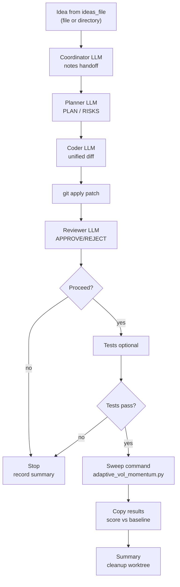

# Multi-Agent Flow

This describes the current multi-agent loop driven by `multi_agent_runner.py`.

## High-level flow

## Artifact pipeline (per iteration)

- `idea.md`: selected idea text.
- `coordinator_prompt.txt` / `coordinator.md`: prompt and notes from coordinator.
- `planner_prompt.txt` / `plan.md`: prompt and detailed plan.
- `coder_prompt_round_<n>.txt` / `patch_round_<n>.diff`: coder prompt and generated diff per round.
- `reviewer_prompt_round_<n>.txt` / `review_round_<n>.md`: reviewer prompt and verdict per round.
- `tests.log`: optional test run output.
- `sweep.log`: sweep command output.
- `meta_config_sweep_results.csv`: copied sweep results (if produced).
- `summary.json`: run metadata (idea, notes, plan, patch status, review verdict, tests/sweep exit codes, score).

## Control logic

1. Create git worktree; optionally sync working tree changes if `base_on_working_tree` is true.
2. Coordinator produces notes; planner produces the plan.
3. Coder produces and applies patch; reviewer renders verdict.
4. If reviewer rejects (or patch fails to apply), feed issues back to the coder and retry in the same worktree up to `max_review_rounds` times.
5. If `test_command` is set, run it; require exit code 0 to proceed.
6. Run sweep (`sweep_command`) and log output.
7. Copy sweep `results_csv` into the run dir and score vs `baseline_csv`.
8. Write `summary.json`; delete worktree unless keep flags are set.

## Configuration hooks

- `agents`: per-role LLM config for coordinator, planner, coder, reviewer.
- `prompts`: file paths for each agent.
- `max_review_rounds`: maximum number of coder fix retries after a reviewer rejection (does not include the initial attempt).
- `test_command` / `test_cwd`: optional test gate.
- `sweep_command` / `sweep_cwd`: sweep execution.
- `baseline_csv` / `results_csv`: scoring inputs/outputs.
- `worktree_root` / `experiments_root`: isolation of runs.
- `.env` support: place API keys in `agentic_experimentation/.env` or repo-root `.env`; they are auto-loaded by the runners (vars not already set in the environment).

Reviewer policy
- The reviewer is intended to gate on code correctness/safety only; tests and docs are not required for approval because test execution is handled by the configured `test_command` gate.

## Patch format

The patch produced by the coder must be a git-apply compatible unified diff (i.e., `git diff` style) because patches are applied via `git apply` inside the worktree.

## Cleaning up old worktrees

If you ran with `--keep-worktrees` (or set `keep_worktrees=true`), old worktrees can accumulate under your configured `worktree_root` (default: `agentic_experimentation/worktrees/`).

- List existing worktrees:
  - `git worktree list`
- Remove a specific worktree directory:
  - `git worktree remove --force agentic_experimentation/worktrees/<run_id>`
- Remove all worktrees under the configured worktree root (PowerShell, from repo root):
  - `Get-ChildItem agentic_experimentation/worktrees -Directory | ForEach-Object { git worktree remove --force $_.FullName }`
  - `git worktree prune`
