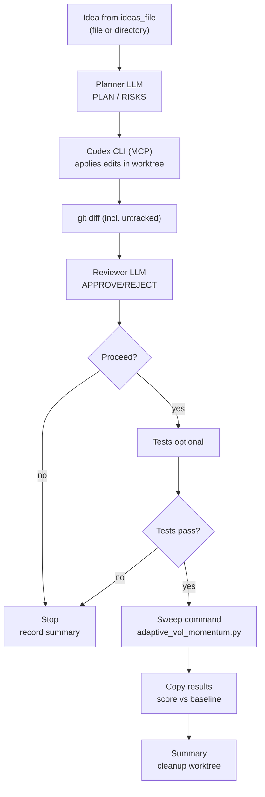

# Multi-Agent Flow

This describes the current multi-agent loop driven by `multi_agent_runner.py`.

## High-level flow

## Artifact pipeline (per iteration)

- `idea.md`: selected idea text.
- `planner_prompt.txt` / `plan.md`: prompt and detailed plan.
- `coder_prompt_round_<n>.txt` / `coder_output_round_<n>.txt`: coder prompt and final natural-language summary per round.
- `diff_round_<n>.diff`: cumulative `git diff` after each coder round (includes untracked files via `git diff --no-index`).
- `reviewer_prompt_round_<n>.txt` / `review_round_<n>.md`: reviewer prompt and verdict per round.
- `agents_trace.jsonl`: local JSONL trace of outer-agent spans (LLM calls, tool calls, etc.).
- `codex_mcp_transcript.jsonl`: local JSONL transcript of Codex MCP tool calls and key events (`tool_call`, `tool_result`, `session_configured`, etc.).
- `tests.log`: optional test run output.
- `sweep.log`: sweep command output.
- `meta_config_sweep_results.csv`: copied sweep results (if produced).
- `summary.json`: run metadata (idea, plan, review verdict, tests/sweep exit codes, score).

## Agent loop (step-by-step)

Each iteration creates an isolated git worktree, then loops `plan → edit → diff → review` until either the reviewer approves or we hit `max_review_rounds`.

1. **Create run directory + worktree**
   - Worktree: `agentic_experimentation/worktrees/<run_id>/`
   - Artifacts: `agentic_experimentation/experiments/<run_id>/`
2. **Planner LLM generates a plan**
   - Inputs: `idea.md`, repo context from `planner_repo_files.txt` (if configured)
   - Outputs: `planner_prompt.txt`, `plan.md`
   - Tracing: `agents_trace.jsonl` has `step=planner` spans
3. **Coder round: Codex edits the worktree in-place**
   - The runner sends the *full* composed prompt (system + `coder_prompt_round_<n>.txt`) to Codex via MCP in a single `codex(...)` call.
   - The runner auto-accepts Codex MCP approval prompts (MCP elicitation) so edits can proceed non-interactively inside the worktree sandbox.
   - Outputs: `coder_prompt_round_<n>.txt`, `coder_output_round_<n>.txt`
   - Tracing: `codex_mcp_transcript.jsonl` includes:
     - `mcp_server_start` / `mcp_server_stop`
     - `mcp_list_tools`
     - `tool_call` / `tool_result` for `codex`
     - `elicitation_request` / `elicitation_response` (approval prompts)
     - `codex_event` `session_configured` (includes `sandbox_policy` and `rollout_path`)
4. **Snapshot cumulative changes**
   - Output: `diff_round_<n>.diff` is the cumulative diff from the worktree (includes untracked files)
5. **Reviewer LLM gates on the diff**
   - Inputs: `reviewer_prompt_round_<n>.txt` contains the idea, plan, and `diff_round_<n>.diff`
   - Output: `review_round_<n>.md` with `VERDICT: APPROVE|REJECT` and issues
   - Tracing: `agents_trace.jsonl` has `step=reviewer` spans
6. **If rejected, loop back to “Coder round”**
   - The runner builds `coder_fix_prompt_round_<n>.txt` using reviewer feedback and re-runs Codex edits in the same worktree.
7. **If approved, optionally run tests**
   - Output: `tests.log` (only if `test_command` is configured)
8. **Run sweep + scoring**
   - Output: `sweep.log`, `meta_config_sweep_results.csv` (if produced), and updated `summary.json`
9. **Cleanup**
   - Worktree is removed unless `--keep-worktrees` or `keep_worktrees=true`.

## Control logic

1. Create git worktree; optionally sync working tree changes if `base_on_working_tree` is true.
2. Planner produces the plan.
3. Coder step delegates to Codex CLI via MCP to edit files in the worktree; the runner snapshots the resulting `git diff`.
4. Reviewer renders verdict on the `git diff`. If rejected, feed issues back to the coder and retry in the same worktree up to `max_review_rounds` times.
5. If `test_command` is set, run it; require exit code 0 to proceed.
6. Run sweep (`sweep_command`) and log output.
7. Copy sweep `results_csv` into the run dir and score vs `baseline_csv`.
8. Write `summary.json`; delete worktree unless keep flags are set.

## Configuration hooks

- `codex_mcp`: how to start Codex CLI as an MCP server (default: `npx -y codex mcp-server`).
- `agents_sdk`: Agents SDK runtime knobs (for example `max_turns`).
- `agents`: per-role model selection/settings for planner and reviewer (the coder “model” is not used when delegating directly to Codex CLI via MCP).
- `prompts`: file paths for each agent.
- `max_review_rounds`: maximum number of coder fix retries after a reviewer rejection (does not include the initial attempt).
- `test_command` / `test_cwd`: optional test gate.
- `sweep_command` / `sweep_cwd`: sweep execution.
- `baseline_csv` / `results_csv`: scoring inputs/outputs.
- `worktree_root` / `experiments_root`: isolation of runs.
- `.env` support: place API keys in `agentic_experimentation/.env` or repo-root `.env`; they are auto-loaded by the runners (vars not already set in the environment).

## Reviewer policy

- The reviewer is intended to gate on code correctness/safety only; tests and docs are not required for approval because test execution is handled by the configured `test_command` gate.

## Patch format

The coder edits files in-place via Codex MCP. The runner records the resulting changes as a cumulative `git diff` for review/auditing. Untracked new files are included using `git diff --no-index`.

## Debugging and tracing

- Local per-run tracing:
  - `agents_trace.jsonl`: planner/reviewer model calls and spans.
  - `codex_mcp_transcript.jsonl`: Codex MCP I/O (this is the primary “what exactly did Codex do?” log).
- Codex rollout log:
  - Look for a `codex_event` with `msg_type: session_configured` in `codex_mcp_transcript.jsonl` and open its `rollout_path` (a `~/.codex/sessions/.../rollout-*.jsonl` file) for Codex’s internal step-by-step log.
- OpenAI Traces:
  - If Agents SDK tracing is enabled, you may see HTTP requests to `https://api.openai.com/v1/traces/ingest`. This is separate from the local JSONL logs and is used for the OpenAI platform trace UI.

## Cleaning up old worktrees

If you ran with `--keep-worktrees` (or set `keep_worktrees=true`), old worktrees can accumulate under your configured `worktree_root` (default: `agentic_experimentation/worktrees/`).

- List existing worktrees:
  - `git worktree list`
- Remove a specific worktree directory:
  - `git worktree remove --force agentic_experimentation/worktrees/<run_id>`
- Remove all worktrees under the configured worktree root (PowerShell, from repo root):
  - `Get-ChildItem agentic_experimentation/worktrees -Directory | ForEach-Object { git worktree remove --force $_.FullName }`
  - `git worktree prune`
